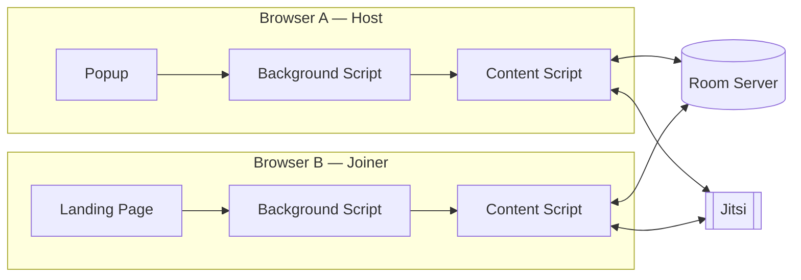

# CoWatch — Project Plan & Architecture (working title)

A Firefox extension that syncs video playback across **any** site with a `<video>` element — not a whitelist of partnered streaming platforms — plus built-in video/voice chat, so people can watch anything together.

This document reflects the plan **after three rounds of self-review** (see Appendix A). Sections below are the current, revised version — not the first draft.

---

## 1. Scope

### In scope (v1)
- Firefox desktop, Manifest V3
- Generic video-element sync (play/pause/seek) on any site
- Room creation + time-limited join links
- Embedded video/voice chat via Jitsi
- Two control modes: open control, or host-only control
- Host leaves → room closes (no hand-off logic in v1)

### Explicitly out of scope (v1)
| Item | Why it's cut, not just forgotten |
|---|---|
| Ad handling | Per-user, per-session problem outside our control — see §6.1 |
| Text chat | Jitsi's voice/video already covers "talking"; can be added in v2 |
| Mobile | Firefox for Android restricts sideloaded extensions to a curated collection |
| DRM circumvention | Never touch decrypted frames — only playback *state* (§2.1) |
| Chrome/other browsers | Firefox-only for v1, though built on standard WebExtension APIs so a port isn't a rewrite |

---

## 2. Architecture Overview

Four components:

1. **Extension** — popup, background script, content script (runs on every page)
2. **Room server** — small stateful service: room registry + WebSocket relay
3. **Landing page** — the one page hosted on a real domain, used only for the join-link handoff
4. **Jitsi** — embedded via IFrame API; handles all WebRTC signaling, NAT traversal, and scaling

### 2.1 The one assumption everything is built on
Even DRM-protected streams (Netflix, Disney+, etc.) render through a standard `HTMLMediaElement`. DRM, via Encrypted Media Extensions, protects the *decoded frame data* — not the element's `currentTime`, `paused` state, or its `play()` / `pause()` / seek events. A generic content script can read and drive playback state on almost any site without ever touching protected content. This is the load-bearing assumption for the entire project, so it's stated explicitly rather than left implicit.

---

## 3. Core Concepts

### 3.1 Room vs. Join Link — not the same thing
- **Room**: the live session. Has a `roomId`, the video URL, participant list, current playback state, and a Jitsi room name. Lives as long as people are in it.
- **Join Link**: a short-lived `joinToken` (10 min TTL) that resolves to a `roomId`. The *link* expiring does not end the *room* — that distinction is what makes "get a fresh link" a meaningful action instead of a contradiction.
- Minting a new link never revokes old ones early; they just age out. (Explicit revocation is a v2 nice-to-have.)

### 3.2 Playback control model
Chosen by the host at room creation:
- **Open control** (default) — anyone's play/pause/seek broadcasts to the room. Best for small, casual groups.
- **Host-only control** — only the host's actions broadcast; everyone else's local clicks are suppressed and their player is fully driven by incoming events. Best for larger or less-coordinated groups.

### 3.3 Host departure
If the host leaves, the room closes for everyone — no migration logic in v1. This is a deliberate scope cut, surfaced in the UI itself ("If the host leaves, this room will end") so it's an expectation, not a surprise.

### 3.4 Sync message types (logic-level, not code)
| Type | Sent by | Carries | Purpose |
|---|---|---|---|
| `play` / `pause` | whoever has control | `currentTime`, `timestamp` | Immediate state change |
| `seeked` | whoever has control | `currentTime`, `timestamp` | Jump to new position |
| `timeSync` | control-holder, every ~5s | `currentTime`, `isPlaying`, `timestamp` | Heartbeat for drift correction |
| `stateRequest` / `stateResponse` | new joiner → server → joiner | full current state | Lets latecomers start at the right position, not `0:00` |
| `presence` | server | join/leave events | Drives participant list + "who has control" UI |

---

## 4. Phase 1 — Core Sync Logic

**Goal:** two browsers, same site, same timestamp, staying that way.

1. Content script runs on every page, watches for `<video>` elements via `MutationObserver` (many sites lazy-load the player, so a one-time check on page load isn't enough).
2. **Disambiguation**: if multiple `<video>` elements exist (ad players, thumbnail previews, background loops), default to the largest one currently visible in the viewport. If that guess is wrong, the user can trigger a "select the video" overlay that highlights candidates — a manual override, not just a silent best-effort guess.
3. Attach `play` / `pause` / `seeked` listeners to the chosen element.
4. Local events → sent over WebSocket per the schema in §3.4.
5. Remote events → applied to the local element, guarded against feedback loops (an event applied *from* the network must not be re-broadcast as if it were local).
6. Drift correction: on each `timeSync` heartbeat, compare local `currentTime` against the broadcast value; correct silently if drift exceeds a small threshold (~1.5s) rather than seeking on every tiny blip.
7. New joiner requests current state before playing anything (see `stateRequest` in §3.4), computes elapsed time since the state's timestamp, seeks to the corrected position, then plays.

No visible UX yet — this phase is plumbing. Controls appear in Phase 4.

---

## 5. Phase 2 — Room Lifecycle

### 5.1 Create room (User A)
1. On any page with a detected video, User A clicks the extension icon.
2. Popup shows **Create Room** (or "No video detected on this page" if none was found — no dead-end click).
3. Popup lets User A pick a control mode (open / host-only) before creating.
4. Extension sends `{videoUrl, controlMode}` to the room server → gets back `{roomId, joinToken, joinUrl}`.
5. Popup shows the link, a Copy button, and "expires in 10 minutes."

### 5.2 Join room (User B)
1. User B clicks the link → opens the **landing page** (not the streaming site directly — the extension can't control that domain, so this hop is unavoidable).
2. Landing page resolves the token server-side:
   - **Expired/invalid** → clear message, no auto-redirect, prompt to ask for a fresh link.
   - **Valid** → shows the destination domain plainly (e.g. "This will open netflix.com") *before* doing anything. Auto-redirecting a browser to a host-supplied URL is, by design, open-redirect-shaped — a bad-faith host could point people at a lookalike phishing page under the guise of "join my watch party." We can't fully close that door without curating allowed domains (which defeats the whole "works on any site" premise), so surfacing the destination plainly is the mitigation.
3. Extension-installed detection: a content script matching only the landing-page's own domain runs there regardless, and messages the background script directly — the standard content-script-to-background channel every extension already has, rather than `externally_connectable` (patchy support, extra complexity, no real upside here).
   - Installed → page shows "Extension detected, continue."
   - Not installed → page shows "Install the extension, then click your link again."
4. On continue: background script navigates the tab to the real `videoUrl`, storing `{pendingRoomId}` in `storage.session` — not a plain JS variable, since Firefox's MV3 background script is a non-persistent event page that can be suspended and restarted, and in-memory state wouldn't survive that.
5. Once the target page loads, the content script checks for a pending join, connects to the room's WebSocket, and requests current state (§4 step 7).
6. If User B isn't logged into that streaming service, or their account/region can't play the title — that's between them and the site. The extension only synchronizes playback once playback is actually possible; it doesn't grant access.

### 5.3 Fresh link
"Copy Link" inside the room re-hits the token-creation endpoint for the existing `roomId`. Mints a new 10-minute token; doesn't touch older ones (§3.1).

---

## 6. Phase 3 — Video Chat

**Goal:** camera/mic without hand-rolling WebRTC signaling.

1. Embed Jitsi via its IFrame API. Derive the Jitsi room name deterministically from `roomId` (e.g. a hash of it), so everyone lands in the same Jitsi room with no separate "enter a room name" step.
2. The iframe needs explicit permission delegation — `allow="camera *; microphone *; display-capture *"` — otherwise `getUserMedia` inside the iframe fails silently in Firefox.
3. Camera/mic toggle buttons in the overlay call Jitsi's IFrame API commands (`toggleAudio`, `toggleVideo`) rather than reimplementing mute state.
4. Start against the public `meet.jit.si` instance; self-hosting (Docker Compose, well-documented) is a drop-in swap later if reliability or scale becomes a real issue — same integration point either way.

### 6.1 On "baking in uBlock"
Worth being precise here: browsers don't let one extension nest another, so "bake it in" isn't literally an option. uBlock Origin's code is also GPL-3.0, so bundling it would carry licensing obligations for your own extension. Two real paths instead:
- **Simplest**: tell users to install uBlock Origin (or any blocker) alongside this extension — no legal or technical entanglement.
- **DIY**: use `declarativeNetRequest` with a public filter list directly — more control, but it's now your own feature to maintain, and filter lists carry their own licenses worth checking first.

Neither is needed for v1 (ads are explicitly out of scope, §1) — this is here so the decision isn't made by accident later.

---

## 7. Phase 4 — UI

### 7.1 Popup
- "Create Room" (or disabled "no video detected" state)
- Control-mode picker at creation
- Post-creation: link, copy button, expiry note

### 7.2 In-page overlay (shadow DOM, so the host site's CSS can't clobber it)
- Bottom bar: participant camera tiles, mic/camera toggles, Leave button, Copy Link button
- "Who has control" indicator when in host-only mode
- Re-parents itself into the browser's native fullscreen element on `fullscreenchange` — most video sites use the real Fullscreen API, and anything not inside that element visually disappears the moment fullscreen is toggled
- "Select the video" overlay, shown when detection is ambiguous (§4 step 2) or manually requested (e.g. a "sync isn't working" button)

### 7.3 Landing page
- Destination-domain confirmation + continue button
- Expired-link state
- Install-prompt fallback state

---

## 8. Known Limitations (v1 — conscious cuts, not oversights)
- Ads unhandled (§6.1)
- No text chat
- Firefox desktop only
- Room state lives in server memory — a restart drops active rooms; fine for early use, Redis-backed persistence is the obvious v2 upgrade
- No early link revocation, only natural expiry
- No host migration — host leaving ends the room

---

## Appendix A — Review & Revision Log

Three rounds of self-review, jury-style, until no further inconsistencies turned up.

### Round 1 — structural gaps
1. **No Room vs. Join Link distinction.** Original flow implied link expiry = room expiry, contradicting the "get a fresh link" idea entirely. → Added §3.1.
2. **"Bake in uBlock" treated as a given.** Extensions can't nest, and uBlock is GPL-3.0 — real licensing implications. → Added §6.1.
3. **No defined host-departure behavior.** Room could be orphaned indefinitely. → Added §3.3, surfaced in UI copy.
4. **Assumed exactly one `<video>` per page.** Many sites have several (ads, thumbnails, background loops). → Added disambiguation + manual override (§4 step 2).
5. **The core feasibility claim (DRM doesn't block playback-state access) was implicit.** Never stated as the load-bearing assumption it is. → Added §2.1.

### Round 2 — subtler issues, after Round 1 fixes
1. **Silent auto-redirect to a host-supplied URL is open-redirect-shaped.** A bad-faith host could disguise a phishing link as "join my watch party." → §5.2 now shows the destination domain before redirecting.
2. **Extension-detection leaned on `externally_connectable`,** which has inconsistent support in Firefox for no real benefit here. → Switched to a same-domain content script messaging background directly (§5.2 step 3).
3. **Terminology drift: "background/service worker" used interchangeably.** Firefox's MV3 background script is a non-persistent event page, not a Chrome-style service worker — in-memory state can vanish on suspension. → §5.2 step 4 now specifies `storage.session`.
4. **Control conflicts (two people seeking at once) were flagged but never resolved.** → Added the open-control / host-only toggle (§3.2).
5. **Jitsi camera/mic assumed to "just work" in an iframe.** iframes need explicit permission delegation or `getUserMedia` fails silently. → Added the `allow` attribute requirement (§6 step 2).

### Round 3 — polish, confirms convergence
1. **"Copy link" behavior was ambiguous** — unclear if it killed the old link. → Clarified: old tokens just expire naturally (§3.1, §5.3).
2. **Text chat scope never explicitly decided**, only silently assumed away — worth stating since Teleparty itself has it. → Added to explicit out-of-scope list with reasoning (§1).
3. **Mobile/platform scope never stated.** → Added to §1, with the actual reason (Firefox Android's extension restrictions).
4. No further structural, UX, or logic inconsistencies found. Remaining items in §8 are deliberate v2 scope decisions, not bugs.

**Verdict:** stable after Round 3 — no open inconsistencies in flow, UX, or logic for the v1 scope as defined.
